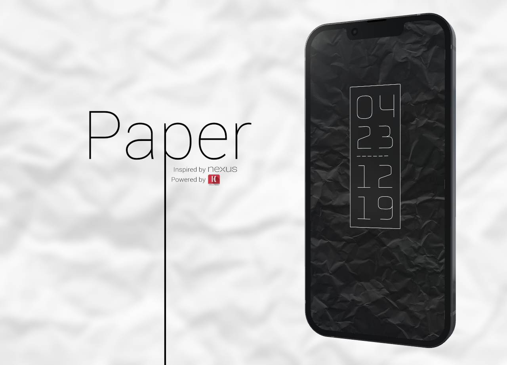
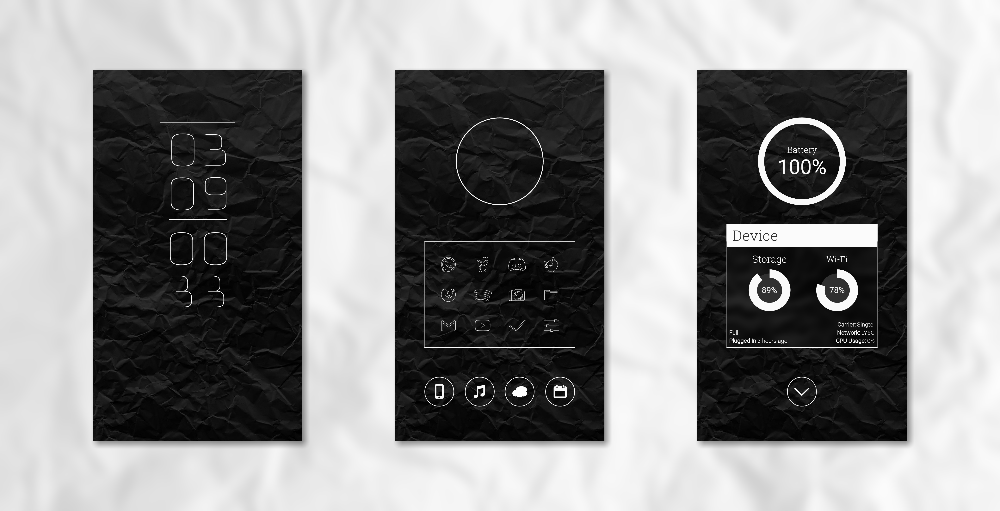

  

  

  

  

# Paper

A minimalistic Kustom. Inspired by Google Nexus.

<h1 align="center"><a href="https://play.google.com/store/apps/details?id=org.kustom.wallpaper">Install with KLWP</a></h1>

## Notice

This wallpapers features a random background slideshow. Place your `.png` or `.jpg` backgrounds in `/storage/emulated/0/Pictures/wallpapers/Day` and in `/storage/emulated/0/Pictures/wallpapers/Night`. The widget will automatically pick a random wallpaper from the folders every hour, depending on if its day or night.